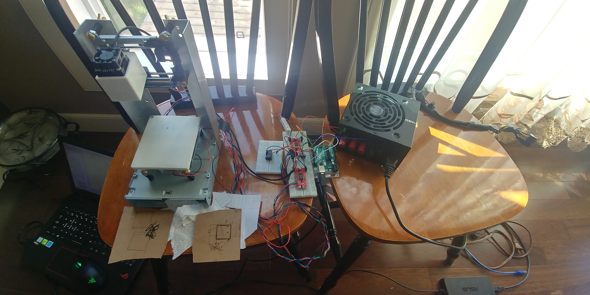
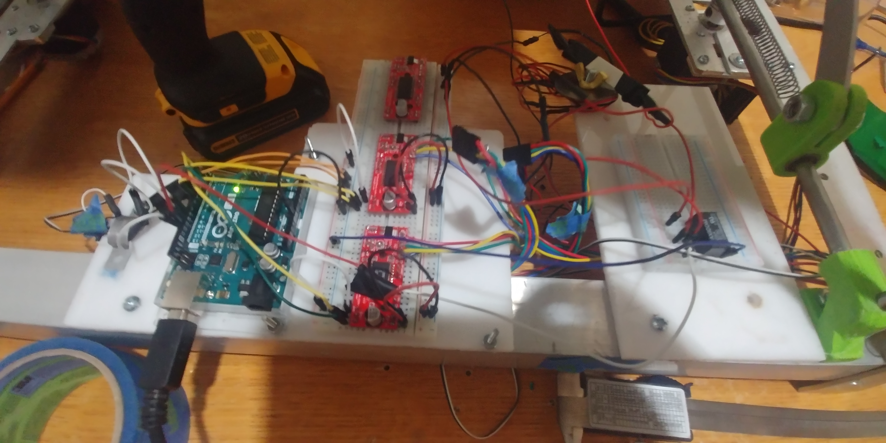
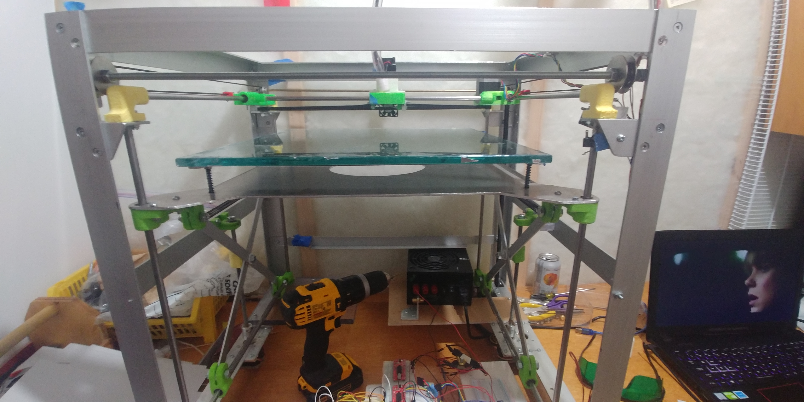
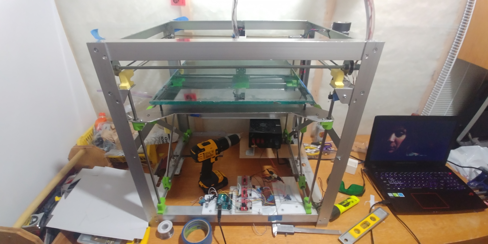

## First version

This is the first version of the laser engraver. For this version, I used an Arduino with the [GRBL](https://github.com/grbl/grbl) firmware as the brains of the unit. I used the trays from optical drives to use for X and Y axis movement since they use stepper motors. In addition to the stepper motors, the laser diodes used in optical drives can also be used but they are difficult to remove intact. 

I used a 15 watt laser diode and it required 12 volts, however, the Arduino could only handle 5 volts. I used a modified pc power supply to provide the differenet voltages and used a relay between the laser and the arduino to switch it on and off.

## Second Version

For this version, I refurbished a 3D printer. I used a [RAMBO](https://reprap.org/wiki/Rambo) mother board with [Marlin](https://marlinfw.org/) fimrware. This is actually a 3D printer firmware but it has support for laser engraving since the Gcodes for the two are very similar. 

One of the main reasons that I decided to make a second version was because I was having problems switching the laser on/off. The pin that controlled the laser on the arduino was next to limit switch pins. In some cases, when the laser was turned on/off and the relay switched, it would cause intereference which would trigger the limit switch pins next to it. The Rambo board I used also took 12 volts so I didnt have to use a relay to turn it on/off,

